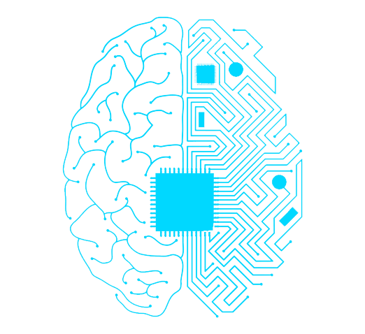

⚠️ Developing

<p align = "center"></p>

<h1 align="center" id="oml">Open Machine Learning</h1>
<p align="center"> 
<a href="#ml-frem">ML Frameworks</a> | 
<a href="#npl-frem">NLP Frameworks</a> | 
<a href="#cvl">Computer Vision Libraries</a> | 
<a href="#mlt">ML Tools</a> | 
<a href="#mlh">ML Hosting</a> | 
<a href="#res">Resources</a> 
</p>

<p align="center"> 
<a href="#contributing">Contributing</a> | 
<a href="#license">License</a> | 
<a href="">Raw</a> 
</p>

<h2 align="center" id="ml-frem">ML Frameworks</h2>

<p align="center">
<a href="#acme">Acme</a>  |  
<a href="#AdaNet">AdaNet</a> | 
<a href="#Analytics-Zoo">Analytics Zoo</a> |
<a href="#Apache-MXNet">Apache MXNet</a> |
<a href="#Apache-Spark">Apache Spark</a> |
<a href="#auto-ml">auto_ml</a> |
<a href="#BigDL">BigDL</a> |
<a href="#Blocks">Blocks</a> |
<a href="#Caffe">Caffe</a> |
<a href="#ConvNetJS">ConvNetJS</a> |
<a href="#DatumBox">DatumBox</a> |
<a href="#deepdetect">deepdetect</a> |
<a href="#DL4J">DL4J</a> |
<a href="#detectron2">detectron2</a>

</p>

---

> > <h2 id="acme">1. Acme</h2>

Acme is a library of reinforcement learning (RL) building blocks that strives to expose simple, efficient, and readable agents. These agents first and foremost serve both as reference implementations as well as providing strong baselines for algorithm performance. However, the baseline agents exposed by Acme should also provide enough flexibility and simplicity that they can be used as a starting block for novel research. Finally, the building blocks of Acme are designed in such a way that the agents can be run at multiple scales (e.g. single-stream vs. distributed agents).

<table>
  <tr>
    <th>language</th>
    <th>source</th>
    <th>license</th>
  </tr>
   <tr>
    <th>python</th>
    <th><a href="https://github.com/deepmind/acme">Github</a></th>
    <th> Apache-2.0 license</th>
  </tr>
  <table>
  
  
---
  
  
>> <h2 id="AdaNet">2. AdaNet</h2>

**AdaNet** is a lightweight TensorFlow-based framework for automatically learning high-quality models with minimal expert intervention. AdaNet builds on recent AutoML efforts to be fast and flexible while providing learning guarantees. Importantly, AdaNet provides a general framework for not only learning a neural network architecture, but also for learning to ensemble to obtain even better models.

This project is based on the _AdaNet algorithm_, presented in “[AdaNet: Adaptive Structural Learning of Artificial Neural Networks](http://proceedings.mlr.press/v70/cortes17a.html)” at [ICML 2017](https://icml.cc/Conferences/2017), for learning the structure of a neural network as an ensemble of subnetworks.

AdaNet has the following goals:

- _Ease of use_: Provide familiar APIs (e.g. Keras, Estimator) for training, evaluating, and serving models.
- _Speed_: Scale with available compute and quickly produce high quality models.
- _Flexibility_: Allow researchers and practitioners to extend AdaNet to novel subnetwork architectures, search spaces, and tasks.
- _Learning guarantees_: Optimize an objective that offers theoretical learning guarantees.

For more information, you may [read the docs](https://adanet.readthedocs.io)

<table>
  <tr>
    <th>language</th>
    <th>source</th>
    <th>license</th>
  </tr>
   <tr>
    <th>python</th>
    <th><a href="https://github.com/tensorflow/adanet">Github</a></th>
    <th> Apache-2.0 license</th>
  </tr>
 <table>

---

> > <h2 id="Analytics-Zoo">3. Analytics Zoo</h2>

Analytics Zoo is an open source _**Big Data AI**_ platform, and includes the following features for scaling end-to-end AI to distributed Big Data:

- [Orca](#getting-started-with-orca): seamlessly scale out TensorFlow and PyTorch for Big Data (using Spark & Ray)

- [RayOnSpark](#getting-started-with-rayonspark): run Ray programs directly on Big Data clusters

- [BigDL Extensions](#getting-started-with-bigdl-extensions): high-level Spark ML pipeline and Keras-like APIs for BigDL

- [Chronos](#getting-started-with-chronos): scalable time series analysis using AutoML

- [PPML](#ppml-privacy-preserving-machine-learning): privacy preserving big data analysis and machine learning (_experimental_)

For more information, you may [read the docs](https://analytics-zoo.readthedocs.io/).

<table>
  <tr>
    <th>language</th>
    <th>source</th>
    <th>license</th>
  </tr>
   <tr>
    <th>python</th>
    <th><a href="https://github.com/intel-analytics/analytics-zoo">Github</a></th>
    <th> Apache-2.0 license</th>
  </tr>
 <table>

---

> > <h2 id="Apache-MXNet">4. Apache MXNet</h2>

Apache MXNet is a deep learning framework designed for both _efficiency_ and _flexibility_.
It allows you to **_mix_** [symbolic and imperative programming](https://mxnet.apache.org/api/architecture/program_model)
to **_maximize_** efficiency and productivity.
At its core, MXNet contains a dynamic dependency scheduler that automatically parallelizes both symbolic and imperative operations on the fly.
A graph optimization layer on top of that makes symbolic execution fast and memory efficient.
MXNet is portable and lightweight, scalable to many GPUs and machines.

Apache MXNet is more than a deep learning project. It is a [community](https://mxnet.apache.org/versions/master/community)
on a mission of democratizing AI. It is a collection of [blue prints and guidelines](https://mxnet.apache.org/api/architecture/overview)
for building deep learning systems, and interesting insights of DL systems for hackers.

For more information, visit [mxnet.apache.org](https://mxnet.apache.org)

<table>
  <tr>
    <th>language</th>
    <th>source</th>
    <th>license</th>
  </tr>
   <tr>
    <th>cpp, python</th>
    <th><a href="https://github.com/apache/incubator-mxnet">Github</a></th>
    <th> Apache-2.0 license</th>
  </tr>
 <table>

---

> > <h2 id="Apache-Spark">5. Apache Spark</h2>

Spark is a unified analytics engine for large-scale data processing. It provides
high-level APIs in Scala, Java, Python, and R, and an optimized engine that
supports general computation graphs for data analysis. It also supports a
rich set of higher-level tools including Spark SQL for SQL and DataFrames,
pandas API on Spark for pandas workloads, MLlib for machine learning, GraphX for graph processing,
and Structured Streaming for stream processing.

<https://spark.apache.org/>

<table>
  <tr>
    <th>language</th>
    <th>source</th>
    <th>license</th>
  </tr>
   <tr>
    <th>scala, python, java, etc</th>
    <th><a href="https://github.com/apache/spark">Github</a></th>
    <th> Apache-2.0 license</th>
  </tr>
 <table>

---

> > <h2 id="auto-ml">6. auto_ml</h2>

Automated machine learning for analytics & production. [UNMAINTAINED]

<table>
  <tr>
    <th>language</th>
    <th>source</th>
    <th>license</th>
  </tr>
   <tr>
    <th>python</th>
    <th><a href="https://github.com/ClimbsRocks/auto_ml">Github</a></th>
    <th> MIT License</th>
  </tr>
 <table>
 
 ---
 
 >> <h2 id="BigDL">7. BigDL</h2> 
 
BigDL seamlessly scales your data analytics & AI applications from laptop to cloud, with the following libraries:

- [Orca](#orca): Distributed Big Data & AI (TF & PyTorch) Pipeline on Spark and Ray

- [Nano](#nano): Transparent Acceleration of Tensorflow & PyTorch Programs

- [DLlib](#dllib): “Equivalent of Spark MLlib” for Deep Learning

- [Chronos](#chronos): Scalable Time Series Analysis using AutoML

- [Friesian](#friesian): End-to-End Recommendation Systems

- [PPML](#ppml) (experimental): Secure Big Data and AI (with SGX Hardware Security)

For more information, you may [read the docs](https://bigdl.readthedocs.io/).

<table>
  <tr>
    <th>language</th>
    <th>source</th>
    <th>license</th>
  </tr>
   <tr>
    <th>scala, python, java, etc</th>
    <th><a href="https://github.com/intel-analytics/BigDL">Github</a></th>
    <th> Apache-2.0 license</th>
  </tr>
 <table>

---

> > <h2 id="Blocks">8. Blocks</h2>

Blocks is a framework that helps you build neural network models on top of
Theano. Currently it supports and provides:

- Constructing parametrized Theano operations, called "bricks"
- Pattern matching to select variables and bricks in large models
- Algorithms to optimize your model
- Saving and resuming of training
- Monitoring and analyzing values during training progress (on the training set
  as well as on test sets)
- Application of graph transformations, such as dropout

In the future we also hope to support:

- Dimension, type and axes-checking

Please see the [documentation](http://blocks.readthedocs.org) for more information.

<table>
  <tr>
    <th>language</th>
    <th>source</th>
    <th>license</th>
  </tr>
   <tr>
    <th>python</th>
    <th><a href="https://github.com/mila-iqia/blocks">Github</a></th>
    <th><a href="https://github.com/mila-iqia/blocks/blob/master/LICENSE">LICENSE</a></th>
  </tr>
 <table>
 
---
 
 >> <h2 id="Caffe">9. Caffe</h2> 
 
Caffe is a deep learning framework made with expression, speed, and modularity in mind.
It is developed by Berkeley AI Research ([BAIR](http://bair.berkeley.edu))/The Berkeley Vision and Learning Center (BVLC) and community contributors.

Check out the [project site](http://caffe.berkeleyvision.org) for all the details like

- [DIY Deep Learning for Vision with Caffe](https://docs.google.com/presentation/d/1UeKXVgRvvxg9OUdh_UiC5G71UMscNPlvArsWER41PsU/edit#slide=id.p)
- [Tutorial Documentation](http://caffe.berkeleyvision.org/tutorial/)
- [BAIR reference models](http://caffe.berkeleyvision.org/model_zoo.html) and the [community model zoo](https://github.com/BVLC/caffe/wiki/Model-Zoo)
- [Installation instructions](http://caffe.berkeleyvision.org/installation.html)

<table>
  <tr>
    <th>language</th>
    <th>source</th>
    <th>license</th>
  </tr>
   <tr>
    <th>cpp, python</th>
    <th><a href="https://github.com/BVLC/caffe">Github</a></th>
    <th><a href="https://github.com/BVLC/caffe/blob/master/LICENSE">LICENSE</a></th>
  </tr>
 <table>
 
 
---

> > <h2 id="ConvNetJS">10. ConvNetJS</h2>

ConvNetJS is a Javascript implementation of Neural networks, together with nice browser-based demos. It currently supports:

- Common **Neural Network modules** (fully connected layers, non-linearities)
- Classification (SVM/Softmax) and Regression (L2) **cost functions**
- Ability to specify and train **Convolutional Networks** that process images
- An experimental **Reinforcement Learning** module, based on Deep Q Learning

For much more information, see the main page at [convnetjs.com](http://convnetjs.com)

<table>
  <tr>
    <th>language</th>
    <th>source</th>
    <th>license</th>
  </tr>
   <tr>
    <th>javascript</th>
    <th><a href="https://github.com/karpathy/convnetjs">Github</a></th>
    <th>MIT license</th>
  </tr>
 <table>
 
 
---

> > <h2 id="DatumBox">11. DatumBox</h2>

The Datumbox Machine Learning Framework is an open-source framework written in Java which allows the rapid development Machine Learning and Statistical applications. The main focus of the framework is to include a large number of machine learning algorithms & statistical methods and to be able to handle large sized datasets.

Datumbox comes with a large number of pre-trained models which allow you to perform Sentiment Analysis (Document & Twitter), Subjectivity Analysis, Topic Classification, Spam Detection, Adult Content Detection, Language Detection, Commercial Detection, Educational Detection and Gender Detection. To get the binary models check out the [Datumbox Zoo](https://github.com/datumbox/datumbox-framework-zoo/).

The Framework currently supports performing multiple Parametric & non-parametric Statistical tests, calculating descriptive statistics on censored & uncensored data, performing ANOVA, Cluster Analysis, Dimension Reduction, Regression Analysis, Timeseries Analysis, Sampling and calculation of probabilities from the most common discrete and continues Distributions. In addition it provides several implemented algorithms including Max Entropy, Naive Bayes, SVM, Bootstrap Aggregating, Adaboost, Kmeans, Hierarchical Clustering, Dirichlet Process Mixture Models, Softmax Regression, Ordinal Regression, Linear Regression, Stepwise Regression, PCA and several other techniques that can be used for feature selection, ensemble learning, linear programming solving and recommender systems.

<https://www.datumbox.com>

<table>
  <tr>
    <th>language</th>
    <th>source</th>
    <th>license</th>
  </tr>
   <tr>
    <th>javascript</th>
    <th><a href="https://github.com/karpathy/convnetjs">Github</a></th>
    <th>MIT license</th>
  </tr>
 <table>

> > <h2 id="deepdetect">12. deepdetect</h2>
> 
DeepDetect (https://www.deepdetect.com/) is a machine learning API and server written in C++11. It makes state of the art machine learning easy to work with and integrate into existing applications. It has support for both training and inference, with automatic conversion to embedded platforms with TensorRT (NVidia GPU) and NCNN (ARM CPU).

It implements support for supervised and unsupervised deep learning of images, text, time series and other data, with focus on simplicity and ease of use, test and connection into existing applications. It supports classification, object detection, segmentation, regression, autoencoders, ...

And it relies on external machine learning libraries through a very generic and flexible API. At the moment it has support for:

- the deep learning libraries [Caffe](https://github.com/BVLC/caffe), [Tensorflow](https://tensorflow.org), [Caffe2](https://caffe2.ai/), [Torch](https://pytorch.org/), [NCNN](https://github.com/Tencent/ncnn) [Tensorrt](https://github.com/NVIDIA/TensorRT) and [Dlib](http://dlib.net/ml.html)
- distributed gradient boosting library [XGBoost](https://github.com/dmlc/xgboost)
- clustering with [T-SNE](https://github.com/DmitryUlyanov/Multicore-TSNE)
- similarity search with [Annoy](https://github.com/spotify/annoy/) and [FAISS](https://github.com/facebookresearch/faiss)

Please join the community on [Gitter](https://gitter.im/beniz/deepdetect), where we help users get through with installation, API, neural nets and connection to external applications.

<https://www.deepdetect.com/>

<table>
  <tr>
    <th>language</th>
    <th>source</th>
    <th>license</th>
  </tr>
   <tr>
    <th>cpp</th>
    <th><a href="https://github.com/jolibrain/deepdetect">Github</a></th>
    <th><a href="https://github.com/jolibrain/deepdetect/blob/master/COPYING">License</th>
  </tr>
  <table>

---

> > <h2 id="DL4J">13. DL4J</h2>

The **[Eclipse Deeplearning4J](https://deeplearning4j.konduit.ai/)** (DL4J) ecosystem is a set of projects intended to support all the needs of a JVM based deep learning application. This means starting with the raw data, loading and preprocessing it from wherever and whatever format it is in to building and tuning a wide variety of simple and complex deep learning networks. 

Because Deeplearning4J runs on the JVM you can use it with a wide variety of JVM based languages other than Java, like Scala, Kotlin, Clojure and many more. 

The DL4J stack comprises of:
- **DL4J**: High level API to build MultiLayerNetworks and ComputationGraphs with a variety of layers, including custom ones. Supports importing Keras models from h5, including tf.keras models (as of 1.0.0-beta7) and also supports distributed training on Apache Spark
- **ND4J**: General purpose linear algebra library with over 500 mathematical, linear algebra and deep learning operations. ND4J is based on the highly-optimized C++ codebase LibND4J that provides CPU (AVX2/512) and GPU (CUDA) support and acceleration by libraries such as OpenBLAS, OneDNN (MKL-DNN), cuDNN, cuBLAS, etc
- **SameDiff** : Part of the ND4J library, SameDiff is our automatic differentiation / deep learning framework. SameDiff uses a graph-based (define then run) approach, similar to TensorFlow graph mode. Eager graph (TensorFlow 2.x eager/PyTorch) graph execution is planned. SameDiff supports importing TensorFlow frozen model format .pb (protobuf) models. Import for ONNX, TensorFlow SavedModel and Keras models are planned. Deeplearning4j also has full SameDiff support for easily writing custom layers and loss functions.
- **DataVec**: ETL for machine learning data in a wide variety of formats and files (HDFS, Spark, Images, Video, Audio, CSV, Excel etc)
- **LibND4J** : C++ library that underpins everything. For more information on how the JVM acceses native arrays and operations refer to [JavaCPP](https://github.com/bytedeco/javacpp)
- **Python4J**: Bundled cpython execution for the JVM

All projects in the DL4J ecosystem support Windows, Linux and macOS. Hardware support includes CUDA GPUs (10.0, 10.1, 10.2 except OSX), x86 CPU (x86_64, avx2, avx512), ARM CPU (arm, arm64, armhf) and PowerPC (ppc64le).

<http://deeplearning4j.konduit.ai/>

<table>
  <tr>
    <th>language</th>
    <th>source</th>
    <th>license</th>
  </tr>
   <tr>
    <th>java, cpp</th>
    <th><a href="https://github.com/deeplearning4j/deeplearning4j">Github</a></th>
    <th>Apache-2.0 license</th>
  </tr>
  <table>

---

> > <h2 id="detectron2">14. detectron2</h2>

Detectron2 is Facebook AI Research's next generation library that provides state-of-the-art detection and segmentation algorithms. It is the successor of [Detectron](https://github.com/facebookresearch/Detectron/) and [maskrcnn-benchmark](https://github.com/facebookresearch/maskrcnn-benchmark/). It supports a number of computer vision research projects and production applications in Facebook.

<https://detectron2.readthedocs.io/en/latest/>


<table>
  <tr>
    <th>language</th>
    <th>source</th>
    <th>license</th>
  </tr>
   <tr>
    <th>python</th>
    <th><a href="https://github.com/facebookresearch/detectron2">Github</a></th>
    <th>Apache-2.0 license</th>
  </tr>
  <table>

---
 

 
---

<h2 align="center" id="npl-frem">NLP Frameworks <a href="#oml">[ ↑ ]</a></h2>
<p align="center"> 
<a href="#AllenNLP">AllenNLP</a>  |  
<a href="#Apache-OpenNLP">Apache OpenNLP</a> | 
<a href="#ERNIE">ERNIE</a> | 
<a href="#flair">flair</a> | 
<a href="#gensim">gensim</a> |
<a href="#icecaps">icecaps</a> |
<a href="#jiant">jiant</a> |
<a href="#NeuralCoref">NeuralCoref</a> |
<a href="#NLP-Architect">NLP Architect</a> |
<a href="#NLTK">NLTK</a> |
<a href="#Pattern">Pattern</a> |
<a href="#spaCy">spaCy</a> |
<a href="#Stanford-CoreNLP">Stanford CoreNLP</a> 
<a href="#SumEval">SumEval</a> |
<a href="#Texar-PyTorch">Texar-PyTorch</a> |
<a href="#TextBlob">TextBlob</a> |
<a href="#Thinc">Thinc</a> |
<a href="#torchtext">torchtext</a> |
<a href="#transformers">transformers</a>

</p>

---

> > <h2 id="AllenNLP">1. AllenNLP</h2>

An Apache 2.0 NLP research library, built on PyTorch, for developing state-of-the-art deep learning models on a wide variety of linguistic tasks.

<https://allennlp.org>

<table>
  <tr>
    <th>language</th>
    <th>source</th>
    <th>license</th>
  </tr>
   <tr>
    <th>python</th>
    <th><a href="https://github.com/allenai/allennlp">Github</a></th>
    <th> Apache-2.0 license</th>
  </tr>
  <table>
  
  
  -----------------------------------------------------

> > <h2 id="Apache-OpenNLP">2. Apache OpenNLP</h2>

The Apache OpenNLP library is a machine learning based toolkit for the processing of natural language text.

This toolkit is written completely in Java and provides support for common NLP tasks, such as tokenization, sentence segmentation, part-of-speech tagging, named entity extraction, chunking, parsing, coreference resolution, language detection and more!

These tasks are usually required to build more advanced text processing services.

The goal of the OpenNLP project is to be a mature toolkit for the above mentioned tasks.

An additional goal is to provide a large number of pre-built models for a variety of languages, as well as the annotated text resources that those models are derived from.

Presently, OpenNLP includes common classifiers such as Maximum Entropy, Perceptron and Naive Bayes.

OpenNLP can be used both programmatically through its Java API or from a terminal through its CLI. OpenNLP API can be easily plugged into distributed streaming data pipelines like Apache Flink, Apache NiFi, Apache Spark.

<https://opennlp.apache.org>

<table>
  <tr>
    <th>language</th>
    <th>source</th>
    <th>license</th>
  </tr>
   <tr>
    <th>java</th>
    <th><a href="https://github.com/apache/opennlp">Github</a></th>
    <th> Apache-2.0 license</th>
  </tr>
  <table>
  
  -----------------------------------------------------

> > <h2 id="ERNIE">3. ERNIE</h2>

Official implementations for various pre-training models of ERNIE-family, covering topics of Language Understanding & Generation, Multimodal Understanding & Generation, and beyond.

<table>
  <tr>
    <th>language</th>
    <th>source</th>
    <th>license</th>
  </tr>
   <tr>
    <th>python</th>
    <th><a href="https://github.com/PaddlePaddle/ERNIE">Github</a></th>
    <th> Apache-2.0 license</th>
  </tr>
  <table>
  
  -----------------------------------------------------

> > <h2 id="flair">4. flair</h2>

- **A powerful NLP library.** Flair allows you to apply our state-of-the-art natural language processing (NLP)
  models to your text, such as named entity recognition (NER), part-of-speech tagging (PoS),
  special support for [biomedical data](https://github.com/flairNLP/flair/blob/master/resources/docs/HUNFLAIR.md),
  sense disambiguation and classification, with support for a rapidly growing number of languages.

- **A text embedding library.** Flair has simple interfaces that allow you to use and combine different word and
  document embeddings, including our proposed **[Flair embeddings](https://www.aclweb.org/anthology/C18-1139/)**, BERT embeddings and ELMo embeddings.

- **A PyTorch NLP framework.** Our framework builds directly on [PyTorch](https://pytorch.org/), making it easy to
  train your own models and experiment with new approaches using Flair embeddings and classes.

<table>
  <tr>
    <th>language</th>
    <th>source</th>
    <th>license</th>
  </tr>
   <tr>
    <th>python</th>
    <th><a href="https://github.com/flairNLP/flair">Github</a></th>
    <th>MIT License</th>
  </tr>
  <table>
  
  -----------------------------------------------------

> > <h2 id="gensim">5. gensim</h2>

Gensim is a Python library for topic modelling, document indexing and similarity retrieval with large corpora. Target audience is the natural language processing (NLP) and information retrieval (IR) community.

<table>
  <tr>
    <th>language</th>
    <th>source</th>
    <th>license</th>
  </tr>
   <tr>
    <th>python</th>
    <th><a href="https://github.com/RaRe-Technologies/gensim">Github</a></th>
    <th>MIT License</th>
  </tr>
  <table>

---

> > <h2 id="icecaps">6. icecaps</h2>

Microsoft Icecaps is an open-source toolkit for building neural conversational systems. Icecaps provides an array of tools from recent conversation modeling and general NLP literature within a flexible paradigm that enables complex multi-task learning setups.

Icecaps is currently on version 0.2.0. In this version we introduced several functionalities:

- Personalization embeddings for transformer models
- Early stopping variant for performing validation across all saved checkpoints
- Implementations for both SpaceFusion and StyleFusion
- New text data processing features, including sorting and trait grounding
- Tree data processing features from JSON files using the new JSONDataProcessor

<table>
  <tr>
    <th>language</th>
    <th>source</th>
    <th>license</th>
  </tr>
   <tr>
    <th>python</th>
    <th><a href="https://github.com/microsoft/icecaps">Github</a></th>
    <th>MIT License</th>
  </tr>
  <table>

---

> > <h2 id="jiant">7. jiant</h2>

**The multitask and transfer learning toolkit for natural language processing research**
**Why should I use `jiant`?**

- `jiant` supports [multitask learning](https://colab.research.google.com/github/nyu-mll/jiant/blob/master/examples/notebooks/jiant_Multi_Task_Example.ipynb)
- `jiant` supports [transfer learning](https://colab.research.google.com/github/nyu-mll/jiant/blob/master/examples/notebooks/jiant_STILTs_Example.ipynb)
- `jiant` supports [50+ natural language understanding tasks](https://github.com/nyu-mll/jiant/blob/master/guides/tasks/supported_tasks.md)
- `jiant` supports the following benchmarks:
  - [GLUE](https://github.com/nyu-mll/jiant/blob/master/guides/benchmarks/glue.md)
  - [SuperGLUE](https://github.com/nyu-mll/jiant/blob/master/guides/benchmarks/superglue.md)
  - [XTREME](https://github.com/nyu-mll/jiant/blob/master/guides/benchmarks/xtreme.md)
- `jiant` is a research library and users are encouraged to extend, change, and contribute to match their needs!

**A few additional things you might want to know about `jiant`:**

- `jiant` is configuration file driven
- `jiant` is built with [PyTorch](https://pytorch.org)
- `jiant` integrates with [`datasets`](https://github.com/huggingface/datasets) to manage task data
- `jiant` integrates with [`transformers`](https://github.com/huggingface/transformers) to manage models and tokenizers.

<table>
  <tr>
    <th>language</th>
    <th>source</th>
    <th>license</th>
  </tr>
   <tr>
    <th>python</th>
    <th><a href="https://github.com/nyu-mll/jiant">Github</a></th>
    <th>MIT License</th>
  </tr>
  <table>

---

> > <h2 id="NeuralCoref">8. NeuralCoref</h2>

NeuralCoref is a pipeline extension for spaCy 2.1+ which annotates and resolves coreference clusters using a neural network. NeuralCoref is production-ready, integrated in spaCy's NLP pipeline and extensible to new training datasets.

For a brief introduction to coreference resolution and NeuralCoref, please refer to our [blog post](https://medium.com/huggingface/state-of-the-art-neural-coreference-resolution-for-chatbots-3302365dcf30).
NeuralCoref is written in Python/Cython and comes with a pre-trained statistical model for **English only**.

NeuralCoref is accompanied by a visualization client [NeuralCoref-Viz](https://github.com/huggingface/neuralcoref-viz), a web interface powered by a REST server that can be [tried online](https://huggingface.co/coref/). NeuralCoref is released under the MIT license.

<table>
  <tr>
    <th>language</th>
    <th>source</th>
    <th>license</th>
  </tr>
   <tr>
    <th>c, python</th>
    <th><a href="https://github.com/huggingface/neuralcoref">Github</a></th>
    <th>MIT License</th>
  </tr>
  <table>

---

> > <h2 id="NLP-Architect">9. NLP Architect</h2>

NLP Architect is an open source Python library for exploring state-of-the-art
deep learning topologies and techniques for optimizing Natural Language Processing and
Natural Language Understanding Neural Networks.

NLP Architect is an NLP library designed to be flexible, easy to extend, allow for easy and rapid integration of NLP models in applications and to showcase optimized models.

Features:

- Core NLP models used in many NLP tasks and useful in many NLP applications
- Novel NLU models showcasing novel topologies and techniques
- Optimized NLP/NLU models showcasing different optimization algorithms on neural NLP/NLU models
- Model-oriented design:
  - Train and run models from command-line.
  - API for using models for inference in python.
  - Procedures to define custom processes for training, inference or anything related to processing.
  - CLI sub-system for running procedures
- Based on optimized Deep Learning frameworks:

  - [TensorFlow]
  - [PyTorch]
  - [Dynet]

- Essential utilities for working with NLP models - Text/String pre-processing, IO, data-manipulation, metrics, embeddings.

<https://intellabs.github.io/nlp-architect>

<table>
  <tr>
    <th>language</th>
    <th>source</th>
    <th>license</th>
  </tr>
   <tr>
    <th>python</th>
    <th><a href="https://github.com/IntelLabs/nlp-architect">Github</a></th>
    <th>Apache-2.0 license</th>
  </tr>
  <table>

---

> > <h2 id="NLTK">10. Natural Language Toolkit (NLTK)</h2>

NLTK -- the Natural Language Toolkit -- is a suite of open source Python modules, data sets, and tutorials supporting research and development in Natural Language Processing. NLTK requires Python version 3.7, 3.8, 3.9 or 3.10.

<https://www.nltk.org>

<table>
  <tr>
    <th>language</th>
    <th>source</th>
    <th>license</th>
  </tr>
   <tr>
    <th>python</th>
    <th><a href="https://github.com/nltk/nltk">Github</a></th>
    <th> Apache-2.0 license</th>
  </tr>
  <table>

---

> > <h2 id="Pattern">11. Pattern</h2>
> > Pattern is a web mining module for Python. It has tools for:

- Data Mining: web services (Google, Twitter, Wikipedia), web crawler, HTML DOM parser
- Natural Language Processing: part-of-speech taggers, n-gram search, sentiment analysis, WordNet
- Machine Learning: vector space model, clustering, classification (KNN, SVM, Perceptron)
- Network Analysis: graph centrality and visualization.

It is well documented, thoroughly tested with 350+ unit tests and comes bundled with 50+ examples. The source code is licensed under BSD.

<https://github.com/clips/pattern/wiki>

<table>
  <tr>
    <th>language</th>
    <th>source</th>
    <th>license</th>
  </tr>
   <tr>
    <th>python</th>
    <th><a href="https://github.com/clips/pattern">Github</a></th>
    <th>BSD-3-Clause license</th>
  </tr>
  <table>

---

> > <h2 id="spaCy">12. spaCy: Industrial-strength NLP</h2>

spaCy is a library for **advanced Natural Language Processing** in Python and
Cython. It's built on the very latest research, and was designed from day one to
be used in real products.

spaCy comes with
[pretrained pipelines](https://spacy.io/models) and
currently supports tokenization and training for **70+ languages**. It features
state-of-the-art speed and **neural network models** for tagging,
parsing, **named entity recognition**, **text classification** and more,
multi-task learning with pretrained **transformers** like BERT, as well as a
production-ready [**training system**](https://spacy.io/usage/training) and easy
model packaging, deployment and workflow management. spaCy is commercial
open-source software, released under the MIT license.

<https://spacy.io/>

<table>
  <tr>
    <th>language</th>
    <th>source</th>
    <th>license</th>
  </tr>
   <tr>
    <th>python, cython</th>
    <th><a href="https://github.com/explosion/spaCy">Github</a></th>
    <th>MIT License</th>
  </tr>
  <table>

---

> > <h2 id="Stanford-CoreNLP">13. Stanford CoreNLP</h2>

[Stanford CoreNLP](http://stanfordnlp.github.io/CoreNLP/) Provides a set of natural language analysis tools written in Java. It can take raw human language text input and give the base forms of words, their parts of speech, whether they are names of companies, people, etc., normalize and interpret dates, times, and numeric quantities, mark up the structure of sentences in terms of phrases or word dependencies, and indicate which noun phrases refer to the same entities. It was originally developed for English, but now also provides varying levels of support for (Modern Standard) Arabic, (mainland) Chinese, French, German, Hungarian, Italian, and Spanish. Stanford CoreNLP is an integrated framework, which makes it very easy to apply a bunch of language analysis tools to a piece of text. Starting from plain text, you can run all the tools with just two lines of code. Its analyses provide the foundational building blocks for higher-level and domain-specific text understanding applications. Stanford CoreNLP is a set of stable and well-tested natural language processing tools, widely used by various groups in academia, industry, and government. The tools variously use rule-based, probabilistic machine learning, and deep learning components.

The Stanford CoreNLP code is written in Java and licensed under the GNU General Public License (v2 or later). Note that this is the full GPL, which allows many free uses, but not its use in proprietary software that you distribute to others.

<http://stanfordnlp.github.io/CoreNLP/>

<table>
  <tr>
    <th>language</th>
    <th>source</th>
    <th>license</th>
  </tr>
   <tr>
    <th>java, </th>
    <th><a href="https://github.com/stanfordnlp/CoreNLP">Github</a></th>
    <th>GPL-3.0 license</th>
  </tr>
  <table>

---

> > <h2 id="SumEval">14. SumEval</h2>

Well tested & Multi-language evaluation framework for Text Summarization.

- Well tested
  - The ROUGE-X scores are tested compare with [original Perl script (ROUGE-1.5.5.pl)](https://github.com/summanlp/evaluation).
  - The BLEU score is calculated by [SacréBLEU](https://github.com/mjpost/sacrebleu), that produces the same values as official script (`mteval-v13a.pl`) used by WMT.
- Multi-language
  - Not only English, Japanese and Chinese are also supported. The other language is extensible [easily](https://github.com/chakki-works/sumeval#welcome-contribution-tada).

Of course, implementation is Pure Python!

<table>
  <tr>
    <th>language</th>
    <th>source</th>
    <th>license</th>
  </tr>
   <tr>
    <th>python</th>
    <th><a href="https://github.com/chakki-works/sumeval">Github</a></th>
    <th>Apache-2.0 license</th>
  </tr>
  <table>

---

> > <h2 id="Texar-PyTorch">15. Texar-PyTorch</h2>

**Texar-PyTorch** is a toolkit aiming to support a broad set of machine learning, especially natural language processing and text generation tasks. Texar provides a library of easy-to-use ML modules and functionalities for composing whatever models and algorithms. The tool is designed for both researchers and practitioners for fast prototyping and experimentation. Texar-PyTorch was originally developed and is
actively contributed by [Petuum](https://petuum.com/) and [CMU](https://www.cmu.edu/) in collaboration with other institutes.
A mirror of this repository is maintained by [Petuum Open Source](https://github.com/petuum).

Texar-PyTorch integrates many of the best features of TensorFlow into PyTorch, delivering highly usable and customizable modules superior to PyTorch native ones.

### Key Features

- **Two Versions, (Mostly) Same Interfaces**. Texar-PyTorch (this repo) and **[Texar-TF](https://github.com/asyml/texar)** have mostly the same interfaces. Both further combine the best design of TF and PyTorch:
  - Interfaces and variable sharing in _PyTorch convention_
  - Excellent factorization and rich functionalities in _TF convention_.
- **Versatile** to support broad needs:
  - data processing, model architectures, loss functions, training and inference algorithms, evaluation, ...
  - encoder(s) to decoder(s), sequential- and self-attentions, memory, hierarchical models, classifiers, ...
  - maximum likelihood learning, reinforcement learning, adversarial learning, probabilistic modeling, ...
- **Fully Customizable** at multiple abstraction level -- both novice-friendly and expert-friendly.
  - Free to plug in whatever external modules, since Texar is fully compatible with the native PyTorch APIs.
- **Modularized** for maximal re-use and clean APIs, based on principled decomposition of _Learning-Inference-Model Architecture_.
- **Rich Pre-trained Models, Rich Usage with Uniform Interfaces**. BERT, GPT2, XLNet, etc, for encoding, classification, generation, and composing complex models with other Texar components!
- Clean, detailed [documentation](https://texar-pytorch.readthedocs.io) and rich [examples](./examples).

<https://asyml.io/>

<table>
  <tr>
    <th>language</th>
    <th>source</th>
    <th>license</th>
  </tr>
   <tr>
    <th>python</th>
    <th><a href="https://github.com/asyml/texar-pytorch">Github</a></th>
    <th>Apache-2.0 license</th>
  </tr>
  <table>

---

> > <h2 id="TextBlob">16. TextBlob</h2>

TextBlob is a Python (2 and 3) library for processing textual data. It provides a simple API for diving into common natural language processing (NLP) tasks such as part-of-speech tagging, noun phrase extraction, sentiment analysis, classification, translation, and more.

<https://textblob.readthedocs.io/>

<table>
  <tr>
    <th>language</th>
    <th>source</th>
    <th>license</th>
  </tr>
   <tr>
    <th>python</th>
    <th><a href="https://github.com/sloria/textblob">Github</a></th>
    <th>MIT License</th>
  </tr>
  <table>

---

> > <h2 id="Thinc">17. Thinc</h2>

[Thinc](https://thinc.ai) is a **lightweight deep learning library** that offers an elegant,
type-checked, functional-programming API for **composing models**, with support
for layers defined in other frameworks such as **PyTorch, TensorFlow and MXNet**. You
can use Thinc as an interface layer, a standalone toolkit or a flexible way to
develop new models. Previous versions of Thinc have been running quietly in
production in thousands of companies, via both [spaCy](https://spacy.io) and
[Prodigy](https://prodi.gy).

<https://thinc.ai/>

<table>
  <tr>
    <th>language</th>
    <th>source</th>
    <th>license</th>
  </tr>
   <tr>
    <th>python, cython</th>
    <th><a href="https://github.com/explosion/thinc">Github</a></th>
    <th>MIT License</th>
  </tr>
  <table>

---

> > <h2 id="torchtext">18. torchtext</h2>

Data loaders and abstractions for text and NLP

This repository consists of:

- [torchtext.datasets](https://github.com/pytorch/text/tree/main/torchtext/datasets): The raw text iterators for common NLP datasets
- [torchtext.data](https://github.com/pytorch/text/tree/main/torchtext/data): Some basic NLP building blocks
- [torchtext.transforms](https://github.com/pytorch/text/tree/main/torchtext/transforms): Basic text-processing transformations
- [torchtext.models](https://github.com/pytorch/text/tree/main/torchtext/models): Pre-trained models
- [torchtext.vocab](https://github.com/pytorch/text/tree/main/torchtext/vocab): Vocab and Vectors related classes and factory functions
- [examples](https://github.com/pytorch/text/tree/main/examples): Example NLP workflows with PyTorch and torchtext library.

<https://pytorch.org/text>

<table>
  <tr>
    <th>language</th>
    <th>source</th>
    <th>license</th>
  </tr>
   <tr>
    <th>python, cpp</th>
    <th><a href="https://github.com/pytorch/text">Github</a></th>
    <th>BSD-3-Clause license</th>
  </tr>
  <table>

---

> > <h2 id="transformers">19. transformers</h2>

**Transformers** provides thousands of pretrained models to perform tasks on different modalities such as text, vision, and audio.

These models can be applied on:

- Text, for tasks like text classification, information extraction, question answering, summarization, translation, text generation, in over 100 languages.
- Images, for tasks like image classification, object detection, and segmentation.
- Audio, for tasks like speech recognition and audio classification.

**Transformer** models can also perform tasks on **several modalities combined**, such as table question answering, optical character recognition, information extraction from scanned documents, video classification, and visual question answering.

**Transformers** provides APIs to quickly download and use those pretrained models on a given text, fine-tune them on your own datasets and then share them with the community on our [model hub](https://huggingface.co/models). At the same time, each python module defining an architecture is fully standalone and can be modified to enable quick research experiments.

**Transformers** is backed by the three most popular deep learning libraries — [Jax](https://jax.readthedocs.io/en/latest/), [PyTorch](https://pytorch.org/) and [TensorFlow](https://www.tensorflow.org/) — with a seamless integration between them. It's straightforward to train your models with one before loading them for inference with the other.

<https://huggingface.co/transformers>

<table>
  <tr>
    <th>language</th>
    <th>source</th>
    <th>license</th>
  </tr>
   <tr>
    <th>python</th>
    <th><a href="https://github.com/huggingface/transformers">Github</a></th>
    <th>Apache-2.0 license</th>
  </tr>
  <table>

---

<h2 align="center" id="cvl">Computer Vision Libraries <a href="#oml">[ ↑ ]</a></h2>

<p align="center">
<a href="#libfacedetection">libfacedetection</a> |  
<a href="#PyTorch-YOLOv3">PyTorch-YOLOv3</a> | 
<a href="#raster-vision">raster-vision</a> | 
<a href="#DeOldify">DeOldify</a> | 
<a href="#SOD">SOD</a> | 
<a href="#makesense-ai">makesense.ai</a> | 
<a href="#DeepPrivacy">DeepPrivacy</a> | 
<a href="#face_recognition">face_recognition</a> | 
<a href="#DeepFaceLab">DeepFaceLab</a> | 
<a href="#faceswap">faceswap</a> 
<a href="#jeelizFaceFilter">jeelizFaceFilter</a> |
<a href="#OpenCV">OpenCV</a> |
<a href="#Luminoth">Luminoth</a>

</p>

---

> > <h2 id="libfacedetection">1. libfacedetection</h2>

This is an open source library for CNN-based face detection in images. The CNN model has been converted to static variables in C source files. The source code does not depend on any other libraries. What you need is just a C++ compiler. You can compile the source code under Windows, Linux, ARM and any platform with a C++ compiler.

SIMD instructions are used to speed up the detection. You can enable AVX2 if you use Intel CPU or NEON for ARM.

The model files are provided in `src/facedetectcnn-data.cpp` (C++ arrays) & [the model (ONNX) from OpenCV Zoo](https://github.com/opencv/opencv_zoo/tree/master/models/face_detection_yunet). You can try our scripts (C++ & Python) in `opencv_dnn/` with the ONNX model. View the network architecture [here](https://netron.app/?url=https://raw.githubusercontent.com/ShiqiYu/libfacedetection.train/master/onnx/yunet*.onnx).

Please note that OpenCV DNN does not support the latest version of YuNet with dynamic input shape. Please ensure you have the exact same input shape as the one in the ONNX model to run latest YuNet with OpenCV DNN.

examples/detect-image.cpp and examples/detect-camera.cpp show how to use the library.

The library was trained by [libfacedetection.train](https://github.com/ShiqiYu/libfacedetection.train).

<table>
  <tr>
    <th>language</th>
    <th>source</th>
    <th>license</th>
  </tr>
   <tr>
    <th>cpp</th>
    <th><a href="https://github.com/ShiqiYu/libfacedetection">Github</a></th>
    <th><a href="https://github.com/ShiqiYu/libfacedetection/blob/master/LICENSE">License</a></th>
  </tr>
  <table>

---

> > <h2 id="PyTorch-YOLOv3">2. PyTorch-YOLOv3</h2>

A minimal PyTorch implementation of YOLOv3, with support for training, inference and evaluation.

<https://pjreddie.com/darknet/yolo/>

<table>
  <tr>
    <th>language</th>
    <th>source</th>
    <th>license</th>
  </tr>
   <tr>
    <th>python</th>
    <th><a href="https://github.com/eriklindernoren/PyTorch-YOLOv3">Github</a></th>
    <th>GPL-3.0 license</th>
  </tr>
  <table>

---

> > <h2 id="raster-vision">3. raster-vision</h2>

Raster Vision is an open source Python framework for building computer vision models on satellite, aerial, and other large imagery sets (including oblique drone imagery).

- It allows users (who don't need to be experts in deep learning!) to quickly and repeatably configure experiments that execute a machine learning pipeline including: analyzing training data, creating training chips, training models, creating predictions, evaluating models, and bundling the model files and configuration for easy deployment.

<table>
  <tr>
    <th>language</th>
    <th>source</th>
    <th>license</th>
  </tr>
   <tr>
    <th>python</th>
    <th><a href="https://github.com/azavea/raster-vision">Github</a></th>
    <th><a href="https://github.com/azavea/raster-vision/blob/master/LICENSE">License</a></th>
  </tr>
  <table>

---

> > <h2 id="DeOldify">4. DeOldify</h2>

**Quick Start**: The easiest way to colorize images using open source DeOldify
(for free!) is here: [DeOldify Image Colorization on DeepAI](https://deepai.org/machine-learning-model/colorizer)

**Desktop**: Want to run open source DeOldify for photos on Windows desktop?
ColorfulSoft made such a thing here and it really works- <https://github.com/ColorfulSoft/DeOldify.NET>.
No GPU required!

The **most advanced** version of DeOldify image colorization is available here,
exclusively. Try a few images for free! [MyHeritage In Color](https://www.myheritage.com/incolor)

**Huggingface Web Demo**: Integrated to [Huggingface Spaces](https://huggingface.co/spaces)
with [Gradio](https://github.com/gradio-app/gradio).
See demo: [Hugging Face Spaces](https://huggingface.co/spaces/PaddlePaddle/deoldify)

<table>
  <tr>
    <th>language</th>
    <th>source</th>
    <th>license</th>
  </tr>
   <tr>
    <th>python</th>
    <th><a href="https://github.com/jantic/DeOldify">Github</a></th>
    <th>MIT License</th>
  </tr>
  <table>

---

> > <h2 id="SOD">5. SOD</h2>

SOD is an embedded, modern cross-platform computer vision and machine learning software library that exposes a set of APIs for deep-learning, advanced media analysis & processing including real-time, multi-class object detection and model training on embedded systems with limited computational resource and IoT devices.

SOD was built to provide a common infrastructure for computer vision applications and to accelerate the use of machine perception in open source as well commercial products.

Designed for computational efficiency and with a strong focus on real-time applications. SOD includes a comprehensive set of both classic and state-of-the-art deep-neural networks with their <a href="https://pixlab.io/downloads">pre-trained models</a>. Built with SOD:

- <a href="https://sod.pixlab.io/intro.html#cnn">Convolutional Neural Networks (CNN)</a> for multi-class (20 and 80) object detection & classification.
- <a href="https://sod.pixlab.io/api.html#cnn">Recurrent Neural Networks (RNN)</a> for text generation (i.e. Shakespeare, 4chan, Kant, Python code, etc.).
- <a href="https://sod.pixlab.io/samples.html">Decision trees</a> for single class, real-time object detection.
- A brand new architecture written specifically for SOD named <a href="https://sod.pixlab.io/intro.html#realnets">RealNets</a>.

<https://sod.pixlab.io/>

<table>
  <tr>
    <th>language</th>
    <th>source</th>
    <th>license</th>
  </tr>
   <tr>
    <th>c</th>
    <th><a href="https://github.com/symisc/sod">Github</a></th>
    <th><a href="https://github.com/symisc/sod/blob/master/LICENSE">License</a></th>
  </tr>
  <table>

---

> > <h2 id="makesense-ai">6. makesense.ai</h2>

[makesense.ai](http://makesense.ai/)
is a free-to-use online tool for labeling photos. Thanks to the use of a browser it does not require any complicated installation - just visit the website and you are ready to go. It also doesn't matter which operating system you're running on - we do our best to be truly cross-platform. It is perfect for small computer vision deep learning projects, making the process of preparing a dataset much easier and faster. Prepared labels can be downloaded in one of the multiple supported formats. The application was written in TypeScript and is based on React/Redux duo.

<https://makesense.ai/>

<table>
  <tr>
    <th>language</th>
    <th>source</th>
    <th>license</th>
  </tr>
   <tr>
    <th>typescript</th>
    <th><a href="https://github.com/SkalskiP/make-sense">Github</a></th>
    <th>GPL-3.0 license</th>
  </tr>
  <table>

---

> > <h2 id="DeepPrivacy">7. DeepPrivacy</h2>

DeepPrivacy is a fully automatic anonymization technique for images.

This repository contains the source code for the paper [_"DeepPrivacy: A Generative Adversarial Network for Face Anonymization"_](https://arxiv.org/abs/1909.04538) published at ISVC 2019, and [_"Image Inpainting with Learnable Feature Imputation
"_](https://arxiv.org/abs/2011.01077) published at GCPR 2020.

[[**Interactive Demo**]](https://huggingface.co/spaces/haakohu/DeepPrivacy)

<table>
  <tr>
    <th>language</th>
    <th>source</th>
    <th>license</th>
  </tr>
   <tr>
    <th>python</th>
    <th><a href="https://github.com/hukkelas/DeepPrivacy">Github</a></th>
    <th>MIT License</th>
  </tr>
  <table>

---

> > <h2 id="face_recognition">8. face_recognition</h2>

The world's simplest facial recognition api for Python and the command line

Recognize and manipulate faces from Python or from the command line with the world's simplest face recognition library

<table>
  <tr>
    <th>language</th>
    <th>source</th>
    <th>license</th>
  </tr>
   <tr>
    <th>python</th>
    <th><a href="https://github.com/ageitgey/face_recognition">Github</a></th>
    <th>MIT License</th>
  </tr>
  <table>

---

> > <h2 id="DeepFaceLab">9. DeepFaceLab</h2>

DeepFaceLab is the leading software for creating deepfakes.
More than **95%** of deepfake videos are created with DeepFaceLab.

<table>
  <tr>
    <th>language</th>
    <th>source</th>
    <th>license</th>
  </tr>
   <tr>
    <th>python</th>
    <th><a href="https://github.com/iperov/DeepFaceLab">Github</a></th>
    <th> GPL-3.0 license</th>
  </tr>
  <table>

---

> > <h2 id="faceswap">10. faceswap</h2>

FaceSwap is a tool that utilizes deep learning to recognize and swap faces in pictures and videos.

<https://www.faceswap.dev/>

<table>
  <tr>
    <th>language</th>
    <th>source</th>
    <th>license</th>
  </tr>
   <tr>
    <th>python</th>
    <th><a href="https://github.com/deepfakes/faceswap">Github</a></th>
    <th>GPL-3.0 license</th>
  </tr>
  <table>

---

> > <h2 id="jeelizFaceFilter">11. jeelizFaceFilter</h2>

This JavaScript library detects and tracks the face in real time from the camera video feed captured with WebRTC. Then it is possible to overlay 3D content for augmented reality applications. We provide various demonstrations using the main WebGL 3D engines. We have included in this repository the release versions of the 3D engines to work with a determined version (they are in `/libs/<name of the engine>/`).

This library is lightweight and it does not include any 3D engine or third party library. We want to keep it framework agnostic so the outputs of the library are raw: if the face is detected or not, the position and the scale of the detected face and the rotation Euler angles. But thanks to the featured helpers, examples and boilerplates, you can quickly deal with a higher level context (for motion head tracking, for face filter or face replacement...).

<https://jeeliz.com/>

<table>
  <tr>
    <th>language</th>
    <th>source</th>
    <th>license</th>
  </tr>
   <tr>
    <th>javascript</th>
    <th><a href="https://github.com/jeeliz/jeelizFaceFilter">Github</a></th>
    <th>Apache-2.0 license</th>
  </tr>
  <table>

---

> > <h2 id="OpenCV">12. OpenCV</h2>

Open Source Computer Vision Library

- Homepage: <https://opencv.org>
  - Courses: <https://opencv.org/courses>
- Docs: <https://docs.opencv.org/4.x/>
- Q&A forum: <https://forum.opencv.org>
  - previous forum (read only): <http://answers.opencv.org>
- Issue tracking: <https://github.com/opencv/opencv/issues>
- Additional OpenCV functionality: <https://github.com/opencv/opencv_contrib>

<table>
  <tr>
    <th>language</th>
    <th>source</th>
    <th>license</th>
  </tr>
   <tr>
    <th>cpp</th>
    <th><a href="https://github.com/opencv/opencv">Github</a></th>
    <th>Apache-2.0 license</th>
  </tr>
  <table>

---

> > <h2 id="Luminoth">13. Luminoth</h2>

Luminoth is an open source toolkit for **computer vision**. Currently, we support object detection, but we are aiming for much more. It is built in Python, using [TensorFlow](https://www.tensorflow.org/) and [Sonnet](https://github.com/deepmind/sonnet).

<https://tryolabs.com/>

<table>
  <tr>
    <th>language</th>
    <th>source</th>
    <th>license</th>
  </tr>
   <tr>
    <th>python</th>
    <th><a href="https://github.com/tryolabs/luminoth">Github</a></th>
    <th>BSD-3-Clause license</th>
  </tr>
  <table>

---

<h2 align="center" id="mlt">ML Tools <a href="#oml">[ ↑ ]</a></h2>

<p align="center">
<a href="#AIX360">AIX360</a> |  
<a href="#Apollo">Apollo</a> |  
<a href="#DVC">DVC</a> |  


</p>

---

> > <h2 id="AIX360">1. AI Explainability 360</h2>

The AI Explainability 360 toolkit is an open-source library that supports interpretability and explainability of datasets and machine learning models. The AI Explainability 360 Python package includes a comprehensive set of algorithms that cover different dimensions of explanations along with proxy explainability metrics.           

The [AI Explainability 360 interactive experience](http://aix360.mybluemix.net/data) provides a gentle introduction to the concepts and capabilities by walking through an example use case for different consumer personas. The [tutorials and example notebooks](https://github.com/Trusted-AI/AIX360/blob/master/examples) offer a deeper, data scientist-oriented introduction. The complete API is also available. 

<http://aix360.mybluemix.net/>


<table>
  <tr>
    <th>language</th>
    <th>source</th>
    <th>license</th>
  </tr>
   <tr>
    <th>python</th>
    <th><a href="https://github.com/Trusted-AI/AIX360">Github</a></th>
    <th>Apache-2.0 license</th>
  </tr>
  <table>

---

> > <h2 id="Apollo">2. Apollo</h2>

A high performance and flexible architecture which accelerates the development, testing, and deployment of
Autonomous Vehicles.

<http://apollo.auto/>

<table>
  <tr>
    <th>language</th>
    <th>source</th>
    <th>license</th>
  </tr>
   <tr>
    <th>cpp, python, etc..</th>
    <th><a href="https://github.com/ApolloAuto/apollo">Github</a></th>
    <th> Apache-2.0 license</th>
  </tr>
  <table>

---

> > <h2 id="DVC">3. Data Version Control (DVC)</h2>

**Data Version Control** or **DVC** is a command line tool and **VS Code Extension** to help you develop reproducible machine learning projects:

- **Version** your data and models. Store them in your cloud storage but keep their version info in your Git repo.
- **Iterate** fast with lightweight pipelines. When you make changes, only run the steps impacted by those changes.
- **Track** experiments in your local Git repo (no servers needed).
- **Compare** any data, code, parameters, model, or performance plots.
- **Share** experiments and automatically reproduce anyone's experiment.

<https://dvc.org/>


<table>
  <tr>
    <th>language</th>
    <th>source</th>
    <th>license</th>
  </tr>
   <tr>
    <th>python</th>
    <th><a href="https://github.com/iterative/dvc">Github</a></th>
    <th>Apache-2.0 license</th>
  </tr>
  <table>

---


---

<h2 align="center" id="mlh">ML hosting <a href="#oml">[ ↑ ]</a></h2>

<p align="center">
<a href="#BentoML">BentoML</a> |
<a href="#Streamlit">Streamlit</a> |
<a href="#Acumos">Acumos</a> |
<a href="#Ray">Ray</a> |
<a href="#Turi">Turi</a> 


</p>

---

> > <h2 id="BentoML">1. BentoML</h2>

BentoML makes it easy to create Machine Learning services that are ready to deploy and scale.

- [Documentation](https://docs.bentoml.org/) - Overview of the BentoML docs and related resources
- [Tutorial: Intro to BentoML](https://docs.bentoml.org/en/latest/tutorial.html) - Learn by doing! In under 10 minutes, you'll serve a model via REST API and generate a docker image for deployment.
- [Main Concepts](https://docs.bentoml.org/en/latest/concepts/index.html) - A step-by-step tour for learning main concepts in BentoML
- [Examples](https://github.com/bentoml/BentoML/tree/main/examples) - Gallery of sample projects using BentoML
- [ML Framework Guides](https://docs.bentoml.org/en/latest/frameworks/index.html) - Best practices and example usages by the ML framework of your choice
- [Advanced Guides](https://docs.bentoml.org/en/latest/guides/index.html) - Learn about BentoML's internals, architecture and advanced features
- Need help? [Join BentoML Community Slack 💬](https://l.linklyhq.com/l/ktOh)

<https://bentoml.com>

<table>
  <tr>
    <th>language</th>
    <th>source</th>
    <th>license</th>
  </tr>
   <tr>
    <th>python</th>
    <th><a href="https://github.com/bentoml/BentoML">Github</a></th>
    <th>Apache-2.0 license</th>
  </tr>
  <table>

---

> > <h2 id="Streamlit">2. Streamlit</h2>

**The fastest way to build and share data apps.**

Streamlit lets you turn data scripts into shareable web apps in minutes, not weeks. It’s all Python, open-source, and free! And once you’ve created an app you can use our [Community Cloud platform](https://streamlit.io/cloud)
 to deploy, manage, and share your app!

<https://streamlit.io/>


<table>
  <tr>
    <th>language</th>
    <th>source</th>
    <th>license</th>
  </tr>
   <tr>
    <th>python, javascript, typescript</th>
    <th><a href="https://github.com/streamlit/streamlit">Github</a></th>
    <th>Apache-2.0 license</th>
  </tr>
  <table>

---

> > <h2 id="Acumos">3. Acumos</h2>

Acumos is a platform and an open source framework that makes it easy to build, share, and deploy AI apps. It is an LF AI Graduate project.

<https://www.acumos.org/>

<table>
  <tr>
    <th>source</th>
    <th>type</th>
  </tr>
   <tr>
    <th><a href="https://github.com/acumos">Github</a></th>
    <th>organization</th>
  </tr>
  <table>

---

> > <h2 id="Ray">4. Ray</h2>

Ray is a unified framework for scaling AI and Python applications. Ray consists of a core distributed runtime and a toolkit of libraries (Ray AIR) for accelerating ML workloads.

<https://ray.io/>


<table>
  <tr>
    <th>language</th>
    <th>source</th>
    <th>license</th>
  </tr>
   <tr>
    <th>python, cpp, java etc..</th>
    <th><a href="https://github.com/ray-project/ray">Github</a></th>
    <th>Apache-2.0 license</th>
  </tr>
  <table>

---

> > <h2 id="Turi">5. Turi</h2>

Turi Create simplifies the development of custom machine learning models. You
don't have to be a machine learning expert to add recommendations, object
detection, image classification, image similarity or activity classification to
your app.

* **Easy-to-use:** Focus on tasks instead of algorithms
* **Visual:** Built-in, streaming visualizations to explore your data
* **Flexible:** Supports text, images, audio, video and sensor data
* **Fast and Scalable:** Work with large datasets on a single machine
* **Ready To Deploy:** Export models to Core ML for use in iOS, macOS, watchOS, and tvOS apps


<table>
  <tr>
    <th>language</th>
    <th>source</th>
    <th>license</th>
  </tr>
   <tr>
    <th>cpp, python, javascript, ect..</th>
    <th><a href="https://github.com/apple/turicreate">Github</a></th>
    <th>BSD-3-Clause license</th>
  </tr>
  <table>

---


---

<h2 align="center" id="contributing">Contributing <a href="#oml">[ ↑ ]</a></h2>

```py
Pull requests are welcome!
for major changes, please open an issue first to
discuss what you would like to change.
please make sure to update tests as appropriate.
```

<table>
  <tr>
    <th><a href="./code_of_conduct.md">Code of Conduct</a></th>
    <th><a href="./contributing.md">Contributing</a></th>
  </tr>
  <table>

<h2 align="center" id="license">License <a href="#oml">[ ↑ ]</a></h2>

```py
MIT License

Copyright (c) 2022 wiz

Permission is hereby granted, free of charge, to any person obtaining a copy
of this software and associated documentation files (the "Software"), to deal
in the Software without restriction, including without limitation the rights
to use, copy, modify, merge, publish, distribute, sublicense, and/or sell
copies of the Software, and to permit persons to whom the Software is
furnished to do so, subject to the following conditions:

The above copyright notice and this permission notice shall be included in all
copies or substantial portions of the Software.

THE SOFTWARE IS PROVIDED "AS IS", WITHOUT WARRANTY OF ANY KIND, EXPRESS OR
IMPLIED, INCLUDING BUT NOT LIMITED TO THE WARRANTIES OF MERCHANTABILITY,
FITNESS FOR A PARTICULAR PURPOSE AND NONINFRINGEMENT. IN NO EVENT SHALL THE
AUTHORS OR COPYRIGHT HOLDERS BE LIABLE FOR ANY CLAIM, DAMAGES OR OTHER
LIABILITY, WHETHER IN AN ACTION OF CONTRACT, TORT OR OTHERWISE, ARISING FROM,
OUT OF OR IN CONNECTION WITH THE SOFTWARE OR THE USE OR OTHER DEALINGS IN THE
SOFTWARE.


```

[Lincese](./license.md)

---

<table>
  <tr>
    <th><a href="#OML">[ ↑ ]</a></th>
  </tr>
  <table>
